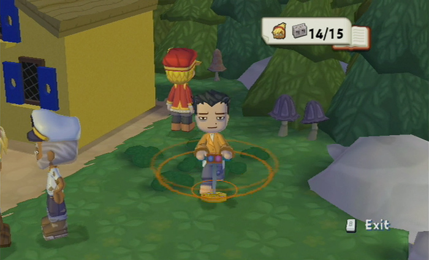
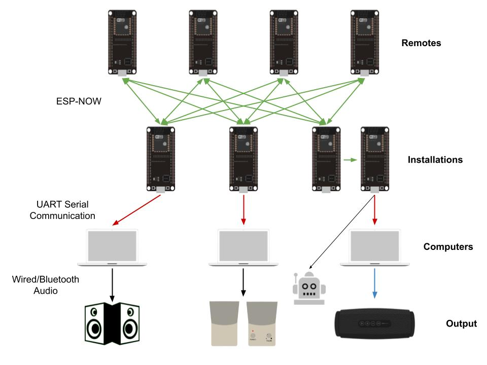
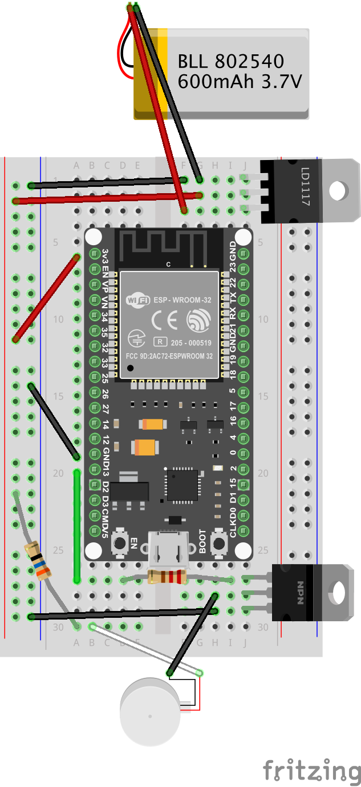
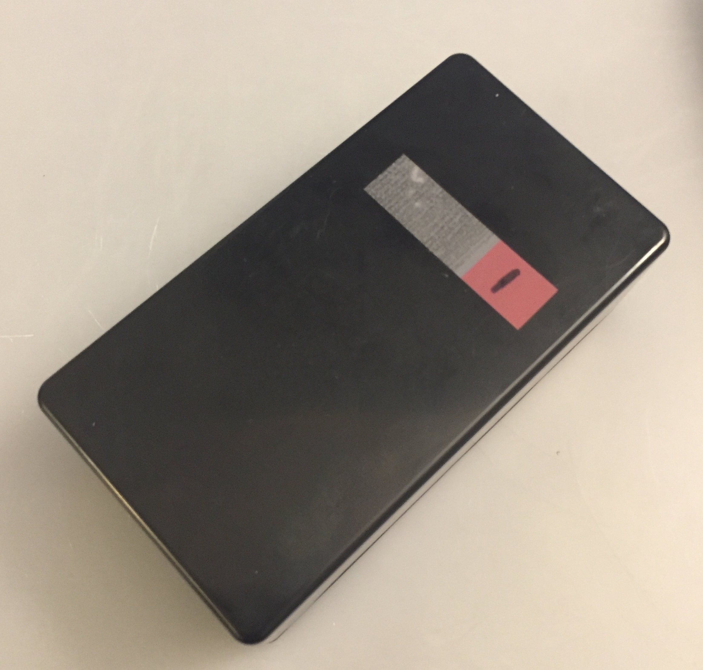

# Module 6: Distributed Networks

## Task Description
This module introduces distributed sensing and actuating networks for larger scale installations, namely through a classwide "takeover" of Arthur K. Watson Hall. The class should collectively create a mesh-style network of ESP32s to realize a creative work within the space of the building. Beyond the ESP32s, the system should make use of some subset of:
- Computers like Raspberry Pis and laptops/desktops
- Actuators like stepper motors
- Digital output like LEDs or projectors
- Analog output like audio

Additionally, the code may run online or offline, as the creative aspect can be in real-time or come as some kind of dynamic or fixed creative object (image, video, audio) that is the result of processing data from the network.

## "Spectre" Remotes: Artificial Intelligence Guides to S.C.O.T.'s AKW Takeover
When we started considering how visitors should interact with our exhibition, we really wanted some sort of automatic event triggering. This seemed like the perfect way to integrate the mesh networking, in particular an extension of my [ESP-NOW remote from Module 4/5](https://www.notion.so/The-Evertree-Harry-Jain-8ff39714a1e0467dbfafbb96bddc90a9). I imagined it a bit like an item or power-up in a video game that allows you to detect collectables, e.g. a compass in Legend of Zelda or the metal detector in MySims. In a similar real-life metaphor, I wanted to make something like a metal detector meets Tile/AirTag, a concept quite close to the end result.

Furthermore, I hoped to evoke the mood of the overall exhibition with the design of these remotes. When we were considering a ghost story, I imagined a flashlight that would "light" your way among the ghosts, giving you a way to communicate with them. When we (briefly) considered a Harry Potter-inspired gathering, I considered making some kind of wand. But when we ultimately transitioned to our story about AI, I wanted more of a "black box" design, much like AI and ML algorithms are often treated as black boxes, with little understanding of their workings or purpose. Thus, people would truly experience the remotes as an unknown, using them as "artificial intelligence guides" to explore and discover features of S.C.O.T.'s AKW takeover while they traversed the exhibition.

## Implementation Details

### Mesh Networking
Due to the complexity of the exhibition and the desire for low latency, ESP-NOW was the obvious choice for connecting the elements of the exhibition. Namely, I wanted to use a "many-to-many" paradigm in which data was sent among all the ESP-32s in a dynamic and interconnected manner. In our initial planning, we considered several potential versions of portable remotes and interactions with the various art installations, namely:

- **Event triggers:** proximity between the remotes and installations would trigger some kind of change, e.g. start the audio or motion
- **Data collectors:** the remotes would collect some sort of data from each visited installation as tokens, e.g. collecting ingredients for a potion or collecting clues for an escape room
- **Feedback devices:** the remotes would respond to some sort of data from the installations as an extra form of interaction and engagement, e.g. LEDs and buzzers to alert for actions and proximity

In the end, we ended up not implementing the idea of data collectors, as we opted for a more experiential exhibition instead of one focused on discovery or collection. Thus, in the network topology, we emphasized triggering events in the installation and giving feedback while viewing the installations. To do so, we configured a system with 4 layers, each connected with a different sort of communication, as exhibited in the diagram below.

The core mesh network came from the ESP32s in the remotes, which connected to the ESP32s controlling most of the installations. In particular, the remotes connected as WiFi access points to the installations, which were configured as WiFi stations. The installations then calculated RSSI values for each of the remotes and sent them back via the ESP-NOW protocol; in response the remotes vibrated if they were close to any installation, with the buzzing increasing as the remote approached the installation (using square-root growth to allow for some buzzing far away and still-moderated buzzing very close). Meanwhile, the installation ESP32s connected to computers via UART serial communication, passing on the proximity data to determine whether to play audio via the speakers. Thus, we were able to trigger the audio story and change the robot head's music based on the proximity of a viewer's remote, all in the context of a complex, multi-device system.

### Circuitry
In terms of the circuit itself, I utilized my aforementioned remote from the previous project as a starting point. The first thing I wanted to do that I didn't have time to implement on the last remote was a vibration motor to give physical feedback, which seemed even more apt in the context of our exhibition. To do so, I used a E3055T NPN transistor to amplify the current from a GPIO control pin such that the buzzer motor would actually vibrate, along with some resistors to further control the current and voltage. Additionally, I used the same LD1117 regulator as on the last two modules to get a consistent 3.3V from a 3.7V LiPo battery for power. By connecting these components as shown in the diagram below, I was able to create a simple yet effective proximity remote control.

### Enclosure
Given the black box inspiration and the limitation on time, the project boxes from the CEID were again a perfect choice. I chose the same size boxes as my remote for *[The Evertree](https://www.notion.so/The-Evertree-Harry-Jain-8ff39714a1e0467dbfafbb96bddc90a9)*, which were exactly wide enough for a breadboard and tall enough to also fit a battery and vibration motor. They were easy to cover for use and uncover for debugging, and the vibrations reverberated perfectly through the plastic. To attach the breadboards, I used Scotch double-sided mounting tape, and for attaching the batteries to the breadboards I used the similar Scotch restickable tabs. Then, I used super glue to attach the buzzer motors, which kept the main body stable while allowing the actuator to spin and buzz. Overall, they were very durable and attractive enclosures, with the only slight difficulty being the long wiring of the buzzers, which needed to be squeezed a bit to fit into the container.

### File Structure
- `README.md` describes all aspects of the remote mesh network, enclosures, circuitry, and code.
- `assets` contains the images and videos relating to the mesh netowrking in the project, many of which are used in `README.md`.
- `installation_template` contains the `installation_template.ino` Arduino sketch that was uploaded to the "installation" ESP32s during the exhibition to listen for remote triggers and send proximity data back.
- `remote_template` contains the `remote_template.ino` Arduino sketch that was uploaded to the remote control ESP32s during the exhibition to receive proximity data and provide feedback.
- `fixed_installation_template` contains the `fixed_installation_template.ino` Arduino sketch that was uploaded to the "installation" ESP32s after the exhibition to allow for the smoother many-to-many connections.
- `fixed_remote_template` contains the `fixed_remote_template.ino` Arduino sketch that was uploaded to the remote control ESP32s after the exhibition to allow for the smoother many-to-many connections.
- `spectre_remote.fzz` is the Fritzing circuit diagram for the remote controls.

## Usage Instructions

### Running and Setup
To run our particular exhibition setup, merely charge the remote batteries, set up all the installations, and walk around AKW. For the remotes in particular, they should be loaded with the updated `fixed_remote_template.ino` sketch, while similarly the installations should use modified versions of the `fixed_installation_template.ino*`sketch. Then, the remotes just need to be powered and carried around the exhibition as you follow the instructions from the audio and directions of the physical signage.

To create a similar mesh system of remotes that trigger various installations, you first need to determine the number of remotes and installations that you wish to implement. Then, design some installations you want to trigger via remotes and build them physically. Next, build the remotes using the circuit diagram above and some sort of simple enclosure. Finally, load the code onto the installations and remotes, putting your installation Arduino code in the `// PUT INSTALLATION SETUP CODE HERE` and `// PUT INSTALLATION LOOPING CODE HERE` comments of `fixed_installation_template.ino`. Afterwards, just set up your exhibition, placing the installations such that interaction via the remotes is as immersive and interesting as possible.

In either scenario, there are several parameters in the code that you can/should tune to your specific setup, primarily within the constants and variables defined at the top of each file, including (in the `fixed_remote_template.ino` file):
- `BUZZ_LIMIT` for adjusting how close remotes have to be to an installation to start buzzing (smaller values require closer contact)
- `REMOTE_COUNT` for recording the number of remotes you have created/are using
- `devices` for recording the MAC addresses of the remotes (running this code once on each remote without setting these will give you the MAC addresses from the `"AP  MAC: "` print statement in `setup`)
- `names` for choosing the names of each remote (not recommended to change the prefix of `Spectre` unless necessary due to other dependencies in `fixed_installation_template.ino` that you would also have to change)
- `passwds` for choosing the passwords of each remote (see above note about changing the `Spectre` prefix)
and (in the `fixed_installation_template.ino`):
- `RSSI_LIMIT` for adjusting how close remotes have to be to trigger an installation
- `LED` for adjusting which pin lights an indicator LED when a remote is close (or can remove altogether along with the lines `digitalWrite(LED, HIGH);` and `digitalWrite(LED, LOW);`)
- `PRINTSCANRESULTS` for printing extra Wi-Fi scan results (`1`) or not (`0`)
- `DELETEBEFOREPAIR` for deleting/resetting remote connections before pairing (`1`) or not (`0`)
- `REMOTE_COUNT` for recording the number of remotes you have created/are using
- `devices` for recording the MAC addresses of the remotes

### Interacting and Debugging
Using this system is meant to be intuitive and exploratory, as you just carry the remote with you throughout the exhibition and see what triggers. You should feel an increasing vibration as you approach an installation, which are typically visible via some sort of speaker arrangement and/or an ESP32 itself. Then, there should be some kind of action or response from the installation, whether through some sort of audio playback or tone change.

Beyond debugging the code and circuitry via traditional measures, you can use the vibration strength of the remote to check if the proximity measurements are correct/working: as you get closer, the vibration should get stronger. If it doesn't, there may be some kind of problem with the mesh code, e.g. an SSID naming discontinuity. Also check if the wiring is still properly connected, as the solders and wiring of the buzzer motors come undone relatively easily. Finally, make sure the batteries did not run out of charge, which takes a long time but does happen eventually (the vibration may stop first since it needs a high amount of power).

## Unrealized Ideas and Theoretical Future Plans
- [ ]  Add indicator LEDs for proximity, battery, etc.
- [ ]  Add physical on/off/settings switches and buttons
- [ ]  Produce more remotes
- [ ]  Add audio via the ESP-32
- [ ]  Improve the proximity-measuring latency and accuracy

There were many additional features that I considered for the remote enclosures, most prominently indicator LEDs for proximity, battery, etc. While I did implement a proximity "red light" to indicate triggering one of the installations, I did not end up drilling the holes to mount it on the box, as it would have destroyed the black box simplicity and was redundant with/distracting from the buzzer feedback. In terms of battery, the chosen LiPo batteries easily lasted through the whole exhibition, as well as several hours of post-exhibition debugging, so an indicator was not too necessary.

With the heavy dependency on a complex wireless system, I think all aspects of our exhibition would have benefitted from some manual controls, which would have made testing and debugging much easier, especially when a crucial component like the remotes were malfunctioning. For the remotes in specific, it might have been helpful to have some kind of switches or potentiometers to adjust the vibration strength and proximity thresholds, as well as an on/off switch to avoid network interference and (to a lesser extent) to save battery when not in use. However, this would have complicated the design and undermined the black box simplicity, and there were not major functionality losses from their omission anyway.

As a small step to increase the engagement of future exhibitions, I would also try to produce more remotes. That way, every visitor could have their own remote and experience the installations individually. And with the updated mesh code for the remotes and installations, it should work smoothly for any number of devices up to the ESP-NOW maximum of 20.

In terms of real "features" beyond the LEDs, the main omission was audio from the remote. At one point, I imagined actual audio feedback from the remote rather than just vibration, but it looked too involved and finicky to combine with everything else. In retrospect, while this would be cool, making the remote into a true AI guide, it was unnecessarily complicated for the value it would have brought compared to the simpler buzzers.

Finally, a sort of reach goal that would require significant restructuring of the system would be improving proximity measurement and latency via some kind of alternate sensor like GPS. For the purpose of our exhibition, this was not much of a problem, as the proximity was just about as sensitive as we desired (~5-15 feet, depending on the walls/obstacles), and the latency was barely noticeable. However, it would have been cool to get some feedback from further distances as well.

## References
**ESP-NOW**
- [https://github.com/espressif/arduino-esp32/tree/master/libraries/ESP32/examples/ESPNow/Basic](https://github.com/espressif/arduino-esp32/tree/master/libraries/ESP32/examples/ESPNow/Basic)
- [https://www.esp32.com/viewtopic.php?t=18291](https://www.esp32.com/viewtopic.php?t=18291)
- [https://www.electrosoftcloud.com/en/esp32-wifi-and-esp-now-simultaneously/](https://www.electrosoftcloud.com/en/esp32-wifi-and-esp-now-simultaneously/)
- [https://randomnerdtutorials.com/esp-now-esp32-arduino-ide/](https://randomnerdtutorials.com/esp-now-esp32-arduino-ide/)
- [https://docs.espressif.com/projects/esp-idf/en/latest/esp32/api-reference/network/esp_now.html](https://docs.espressif.com/projects/esp-idf/en/latest/esp32/api-reference/network/esp_now.html)

**Power**
- [https://techexplorations.com/guides/esp32/begin/power/](https://techexplorations.com/guides/esp32/begin/power/)

**Vibration Motor**
- [https://techzeero.com/arduino-tutorials/vibration-motor-with-arduino/](https://techzeero.com/arduino-tutorials/vibration-motor-with-arduino/)
- [https://thecustomizewindows.com/2021/08/esp32-and-coin-vibrator-motor/](https://thecustomizewindows.com/2021/08/esp32-and-coin-vibrator-motor/)
- [https://www.electronics-tutorials.ws/transistor/tran_2.html](https://www.electronics-tutorials.ws/transistor/tran_2.html)
- [http://www.learningaboutelectronics.com/Articles/Transistor-switch-circuit.php](http://www.learningaboutelectronics.com/Articles/Transistor-switch-circuit.php)
- [https://www.mouser.com/datasheet/2/149/MJE3055T-889641.pdf](https://www.mouser.com/datasheet/2/149/MJE3055T-889641.pdf)

**LEDs**
- [https://techexplorations.com/guides/esp32/begin/digitalout/](https://techexplorations.com/guides/esp32/begin/digitalout/)

**Audio (Defunct)**
- [https://circuitdigest.com/microcontroller-projects/esp32-based-audio-player](https://circuitdigest.com/microcontroller-projects/esp32-based-audio-player)